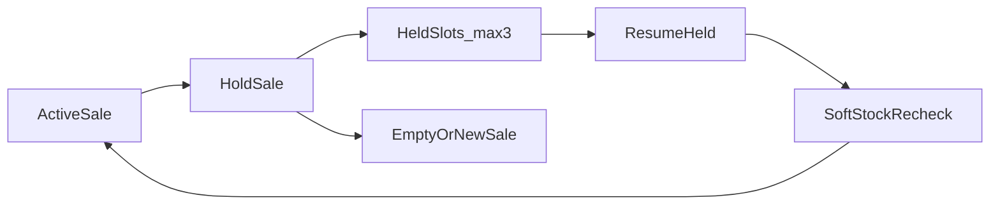

# M3 Slice 6 — Hold / Park Sale (plan)

## Locks (confirmed)

| Topic | Decision |
|-------|----------|
| Placement | **M3 Slice 6** (mid-milestone under desktop POS) — not a new Milestone, not M4 |
| Capacity | **Up to 3 held + 1 active** on one terminal |
| Stock | **Soft hold** — no reservation; re-validate on resume |
| Cloud | **No** new shift/hold/sales APIs |
| Deliverable now | **Docs only** — write Slice 6 into execution + status/master plan; **no app code until you authorize a batch** |

## Problem

Today [`App.tsx`](apps/desktop/src/App.tsx) has a **single** sale: `cartLines` + `saleCustomer` + `appliedLoyalty` + payment modals. `startNewSale` **wipes** that state. Cashier cannot park Customer A at payment and ring Customer B.

## Product behavior (locked)

1. **Hold** allowed when `view === "sale"` and cart has ≥1 line (including while Payment / Cash / Card / MFS / loyalty modals are open).
2. On Hold: snapshot cart + customer + loyalty + FEFO override metadata; **close all POS modals**; abort in-progress card/MFS stub if running; **do not** save cash-received / card-approved / MFS processing drafts.
3. After Hold: land on **empty New Sale** (same shift still open; soft gate unchanged).
4. **Resume** only when active cart is empty (else toast: hold or clear current first). Soft recheck batch stock/expiry; warn/block lines that fail; cashier edits before pay.
5. **Discard held** via confirm (ConfirmDialog). Cap: 4th Hold → toast, no overwrite.
6. Persistence: webview **localStorage** keyed `pharmasync.heldSales.<tenantId>.<storeId>` (same family as [`shiftStore.ts`](apps/desktop/src/lib/shiftStore.ts) / transaction log). Survive reload on that machine only.
7. Chrome: Search Results - Napa; invent Hold UI; `←/→` · Esc; **no Tab**; no Baki; i18n en + bn-BD.
8. Shortcut invent: **F6** Hold (F2/F4/F8/F10 already taken). Held list open from cart chrome or footer — invent in batch prompts.

## Out of scope (Slice 6)

- Hard stock reservation / cloud hold API / multi-terminal shared holds
- Hold from Sale Completed or Counter Ready (nothing to hold)
- Changing shift soft-gate or connectivity badge
- M4 sync flush

## Doc work (this plan’s execution when approved)

1. Append **Slice 6** to [`MILESTONE_3_EXECUTION.md`](MILESTONE_3_EXECUTION.md):
   - Screen inventory: Hold Sale + Held Sales list/resume
   - Design locks (table above)
   - Batch overview **AM → AN → AO → AP**
   - Per-batch tasks + agent prompts (“Implement ONLY Batch …”)
   - Progress tracker + DoD + changelog; update “Next slice” (Hold before “all screens/flow done” / M4)
2. Brief sync in [`Current_Status.md`](Current_Status.md) + [`PROJECT_MASTER_PLAN.md`](PROJECT_MASTER_PLAN.md): next = Slice 6 when authorized; §12 note for soft hold + max 3.
3. Catalog: note in final Slice 6 exit batch (**AP**) that **no new cloud routes** (mirror §17 style) — not in the doc-only pass unless you want a placeholder §18 stub; prefer update on AP implement.

## Implementation batches (later — authorize one at a time)

| Batch | Title | Scope |
|-------|-------|--------|
| **AM** | Held-sale store + snapshot type | `heldSaleStore` + `HeldSaleSnapshot` (lines, customer, loyalty, heldAt, id, label); max 3; tenant+store key |
| **AN** | Hold + Held list UI | Hold action (F6 / cart); list held (↑↓ Enter resume · discard confirm); empty after hold |
| **AO** | Soft resume recheck + payment safety | On resume: stock/expiry soft check + toasts; holding aborts payment modals/stubs cleanly |
| **AP** | Slice 6 exit | DoD checklist; optional `smoke:m3ap`; `Completed_API_lists.md` note; status if asked |

**Primary code touchpoints (when implementing):** [`App.tsx`](apps/desktop/src/App.tsx) sale state machine; [`cartTypes.ts`](apps/desktop/src/features/pos/cartTypes.ts); new `lib/heldSaleStore.ts` + `features/pos` Hold/Held UI; cart/footer chrome; i18n locales.

## Slice 6 Definition of Done

- Hold up to 3 soft parks; ring another sale; resume with soft recheck
- Mid-payment hold does not complete tender or double-charge stub
- Reload keeps held list on that terminal
- No cloud hold API; no hard reserve; no Tab; localized
- Catalog notes “no new routes” on exit batch

## After docs land

You authorize e.g. **“Implement ONLY Batch AM…”** in a fresh chat. Do not start M4 until you choose.