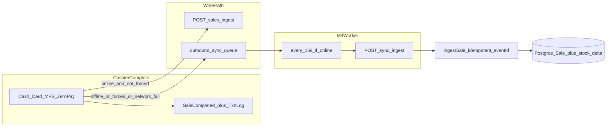

# M4 — One-way Sync (authorized)

**Status:** M0–M3 DONE. M4 authorized 2026-08-13. No Figma — invent the screens listed below.

**Execution rule (same as M3):** write [`MILESTONE_4_EXECUTION.md`](MILESTONE_4_EXECUTION.md) first, then **one batch per chat**. Do not implement this whole plan in one run.

Attach in each batch chat: `PROJECT_MASTER_PLAN.md`, `Current_Status.md`, `MILESTONE_4_EXECUTION.md`, `Completed_API_lists.md`.

---

## Locked decisions

- **Offline complete UX:** same Sale Completed + Receipt Preview as online. Badge shows Pending until flush succeeds. Optional info toast when the sale was queued (i18n), not a second completed screen.
- **UI surface:** invent a **Sync Queue panel** opened from the connectivity badge (and Settings → Connectivity). **No new sidebar nav.** No owner web. Chrome stays **Search Results - Napa** (teal, light shell). **No Tab** navigator; arrows / Enter / Esc.
- **Entities in M4:** `entity_type: "sale"` + `action: "create"` only. Payload = existing camelCase [`saleIngestSchema`](packages/shared-types/src/sale.ts) (`SaleIngestInput`). Cloud reuses [`ingestSale`](apps/server/src/modules/sale/sale.service.ts) so stock is applied as **deltas inside the sale**, never absolute `quantityOnHand` overwrite.
- **Not in M4:** `product` / `customer` / standalone `stock_delta` queue types (Zod may keep them; server **rejects** them). No bi-di catalog sync (M6). No hard hold / cloud sales list / real printer / card SDK / MFS APIs / Baki.
- **Worker location:** TypeScript in the desktop webview (15s), using existing session tokens + `apiRequest`. **Not** a Rust HTTP client — tokens live in localStorage. SQLite I/O stays Tauri IPC (`pos_local.db`); Vite/browser uses the existing memory backend.
- **Online path:** keep `POST /api/v1/sales/ingest` when connected and not Force Offline. If that call fails as **network/5xx**, enqueue the same `eventId` and still complete locally (cash already taken). If **4xx** (validation / 409 stock), do **not** enqueue; stay on payment (today’s behavior).
- **Queue row `id` = sale `eventId`** so retries are naturally idempotent.
- **FIFO:** process oldest pending first. Poison **4xx** → dead-letter that row and continue. Transient **network/5xx** → stop the tick (head-of-line retry). After **8** transient attempts → dead-letter.

---

## Invented screens (cashiers need these; nothing else)

### 1. Sync Queue panel (new)

Invented modal/panel, same family as Shift / Held list (not a route).

- **Open:** badge menu item **Sync queue**; also a control on Settings → Connectivity.
- **Header:** Sync queue · `Pending n` · `Failed n` (Latin digits).
- **List:** one row per unsynced/dead sale — time, `TXN-` / `eventId` tail, ৳ total (from payload), status pill (`Pending` / `Syncing` / `Failed`).
- **Failed subtitle:** `last_error` (server/network message; do not translate domain IDs).
- **Empty:** All synchronized.
- **Keys:** `↑` `↓` move · `Enter` Retry on Failed (clears `dead`, resets attempts) · `Esc` close. No Tab.
- **Retry** does not delete sales (append-only).

### 2. Badge menu (extend existing, not a new screen)

[`ConnectivityBadge.tsx`](apps/desktop/src/features/shell/ConnectivityBadge.tsx) already has Force Offline / Go Online. Add **Sync queue**. Keep existing badge states; wire them to **real** flush (`online_pending`, `online_syncing`, `error` when dead letters or last flush failed). Forced Offline still pauses the worker.

### 3. Settings → Connectivity (extend existing)

Show pending/failed counts + last flush time + **Open sync queue**. Do not restyle Settings chrome.

Sale Completed stays as-is (user lock). Transactions list already records local completes — keep using [`transactionLogStore`](apps/desktop/src/lib/transactionLogStore.ts); do **not** invent a second SQLite sales ledger.

All new copy: `t("...")` in [`en.ts`](apps/desktop/src/i18n/locales/en.ts) + [`bn-BD.ts`](apps/desktop/src/i18n/locales/bn-BD.ts).

---

## Technical shape

### Local queue (extend Batch E table)

Today ([`schema.rs`](apps/desktop/src-tauri/src/db/schema.rs)): `id, entity_type, action, payload, synced, created_at`.

Add (ALTER / `add_column_if_missing` + memory backend parity):

- `attempt_count` INTEGER DEFAULT 0
- `last_error` TEXT
- `last_attempt_at` TEXT
- `dead` INTEGER DEFAULT 0

IPC beyond `enqueue_sync_event` / `count_unsynced`:

- `list_sync_queue` (pending + dead, FIFO)
- `mark_sync_synced` / `mark_sync_attempt` / `mark_sync_dead` / `retry_sync_event`
- `apply_cached_stock_delta` (`batchId`, `quantity_change` negative) so offline FEFO qty stays honest until next catalog pull

`countUnsynced` = `synced = 0 AND dead = 0`. Badge error if any `dead = 1` or last flush failed.

Envelope already in [`packages/shared-types/src/sync.ts`](packages/shared-types/src/sync.ts). Keep snake_case envelope; **payload stays camelCase `SaleIngestInput`**. Add a small **result** Zod type for ingest responses (accepted / duplicate / rejected per `event_id`).

### Cloud `POST /api/v1/sync/ingest`

New `apps/server/src/modules/sync/` (`router → controller → service`), mount on [`apps/server/src/routes/index.ts`](apps/server/src/routes/index.ts).

- Auth: `protect` + `tenantContext` (JWT `tenantId` only).
- Body: existing `syncIngestBatchSchema` (`events[]`).
- Process **in array order**. Each `sale`/`create`: validate payload with `saleIngestSchema` → `ingestSale` (existing idempotency on `Sale.eventId`).
- Response envelope (locked): `{ status, message, data }` where `data.results[]` = `{ eventId, status: "accepted"|"duplicate"|"rejected", message? }`. Partial success is OK (poison does not roll back earlier accepted events).
- Reject unknown `entity_type` / `action` per event (`rejected`), not 500 for the whole batch.
- Cashiers still never see `costPerBase`.

Do **not** change `POST /sales/ingest` behavior for the happy online path.

### Desktop complete path

Replace the four `TODO(M4)` / `navigator.onLine === false` blocks in [`App.tsx`](apps/desktop/src/App.tsx) (cash, card, MFS, zero-pay) with one helper, e.g. `completeSaleOrQueue` in [`saleIngest.ts`](apps/desktop/src/lib/saleIngest.ts):

1. Build payload (`eventId` already client-generated).
2. If `isOnline && !forcedOffline`: try `ingestSale`; on network/5xx → enqueue; on 4xx → throw (no complete).
3. Else: enqueue.
4. On queue path: decrement cached batch qty; `setPendingCount`; append transaction log; proceed to **same** Sale Completed.

Worker: start on shell mount; interval **15s**; also flush immediately on Go Online / `online` event. Pause while Force Offline or `mode !== "online"`. Batch size: up to 10 FIFO per tick; stop tick on first transient failure.

After successful flush of any sale, optionally `catalogPull` (existing) so cache matches cloud — do not invent bi-di sync.

When App starts calling `/sync/ingest`, relax the historical guard in [`smoke-m3ap.ts`](apps/desktop/scripts/smoke-m3ap.ts) (`App must not call M4 sync/ingest`).

**Known gap (document, do not invent void):** if cloud later returns 409 (another terminal already sold the lot), the row dead-letters; local sale stays in the transaction log. M5 conflict UX.

---

## Batches (execute in order, one chat each)

| ID | Batch | Exit |
|----|--------|------|
| **A** | Queue columns + IPC + memory backend (`list` / mark / retry / stock delta). No worker, no API, no UI. | Tauri + memory enqueue → list FIFO → mark synced/dead; `countUnsynced` ignores dead |
| **B** | Cloud `POST /api/v1/sync/ingest` + Zod result + reuse `ingestSale` | `smoke:m4b` (or server smoke): new sale, duplicate `eventId`, poison rejected, unknown entity rejected, cashier no margins |
| **C** | Offline/Force Offline complete → queue + local stock delta + same Sale Completed; online ingest unchanged; network fail → queue | Cash/Card/MFS/zero-pay complete offline without “online required”; pending count increments |
| **D** | 15s flush worker + badge wiring (`syncing` / `pending` / `error`); pause when forced | Reconnect: queued sale appears in Postgres once; second flush is duplicate/no extra stock hit |
| **E** | Invent Sync Queue panel + badge menu + Settings Connectivity; i18n en + bn-BD | Keyboard list/retry/Esc; chrome lock held; no new sidebar item |
| **F** | M4 exit: `Completed_API_lists.md` §19, status + master plan, `smoke:m4` desktop+server | Exit table below green |

Batch A may ship a tiny `MILESTONE_4_EXECUTION.md` header + agent prompts for A–F (first chat writes the file **and** implements A, or a dedicated “Batch 0 docs” if you prefer split — prefer **docs file in the same chat as Batch A** so execution is not a docs-only stall).

---

## Explicitly out of M4

- Slice 7+ POS screens, owner web Create Customer
- Real printer IPC / card SDK / MFS provider APIs
- Cloud `GET /sales`, cloud shift, hard reservation / shared holds
- Catalog CSV, receiving/GRN, paged catalog for thousands of SKUs
- Loyalty persistence, real manager PIN, terminal presence, n8n, RLS
- Baki (still not a tender)

---

## M4 exit (master plan)

Offline sale appears in Postgres after reconnect with **no duplicates**.

Manual path: Open shift → Force Offline → sell Napa → Sale Completed → badge Pending → Go Online → wait ≤15s (or open Sync queue) → `smoke` / Neon shows one `Sale` for that `eventId`; local qty then catalog pull; retry of same event is idempotent.
