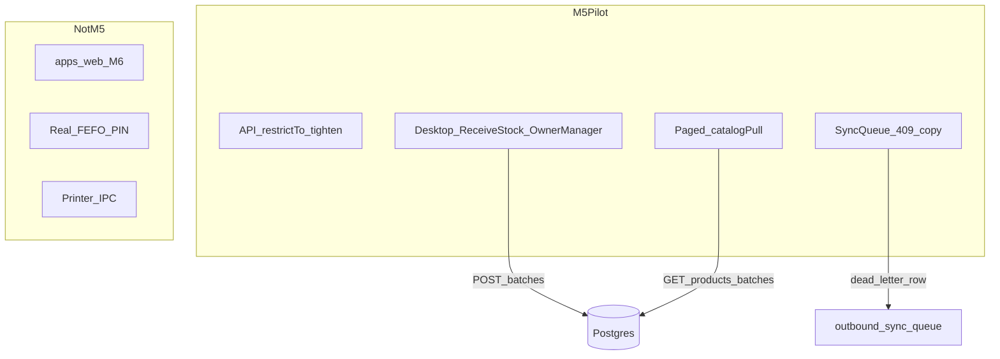

# M5 — MVP Hardening (pilot ready)

**Status:** M0–M4 DONE. This plan is the M5 authorization. **Do not implement this whole plan in one Agent run.**

**Your forks (locked for this plan):** keep **print stub**; keep **FEFO PIN stub**. Real printer IPC and hashed PIN wait for a later authorize.

**Execution rule (same as M3/M4):** write [`MILESTONE_5_EXECUTION.md`](MILESTONE_5_EXECUTION.md) first, then **one batch per chat**. Attach: [`PROJECT_MASTER_PLAN.md`](PROJECT_MASTER_PLAN.md), [`Current_Status.md`](Current_Status.md), [`Completed_API_lists.md`](Completed_API_lists.md), [`ROLES_AND_PERMISSIONS.md`](ROLES_AND_PERMISSIONS.md), `MILESTONE_5_EXECUTION.md`.

**MVP ship gate (master plan):** single-store pharmacy sells online/offline with FEFO; cloud holds sales. **Owner web waits for M6.**

---

## Locked decisions

- **Payments:** `CASH` \| `CARD` \| `MFS` only. Strip the stale “Baki (customer due)” line from master-plan M5. No on-account tender.
- **RBAC source:** [`ROLES_AND_PERMISSIONS.md`](ROLES_AND_PERMISSIONS.md) v2. Live holes to close:
  - [`PATCH /customers/:id`](apps/server/src/modules/customer/customer.router.ts) is any-auth today → **`restrictTo("OWNER", "MANAGER")`**. Cashier = search only.
  - [`PATCH /batches/:id`](apps/server/src/modules/batch/batch.router.ts) lets cashiers change non-price fields (including `quantityOnHand`) → **`restrictTo("OWNER", "MANAGER")`**. Receiving is the qty path.
  - Keep existing: `POST /customers` OWNER-only; cashier never gets `costPerBase`; cashier `403` on price fields.
- **GRN / stock entry:** invent on **desktop** (not `apps/web`). Owner + Manager only. Cashier must not see it. Use **Settings → Receive stock** (or an Inventory section inside Settings) so sidebar chrome stays New Sale / Transactions / Shift / Settings ([`Sidebar.tsx`](apps/desktop/src/features/shell/Sidebar.tsx)). Calls existing `POST /api/v1/batches` (and PATCH for damage/write-off qty). After save, `catalogPull` so POS search sees the new lot.
- **409 conflict UX:** online ingest 409 already stays on payment ([`saleIngest.ts`](apps/desktop/src/lib/saleIngest.ts)). M4 already dead-letters poison 4xx. M5 adds **cashier-visible conflict copy** on Sync Queue Failed rows (insufficient stock / another terminal sold the lot): explain, keep Retry, **do not void or delete the local sale**.
- **Catalog for counter:** page [`catalogPull.ts`](apps/desktop/src/lib/localDb/catalogPull.ts) (`limit=100` today) until `meta.total` is exhausted (sane cap). Still a lean cache; Neon stays source of truth. **No CSV import** unless you re-authorize.
- **Stay stubs / out of M5:** print IPC, FEFO `pinHash`, real card SDK, real MFS APIs, loyalty persist, cloud `GET /sales`, cloud shift, bi-di sync, n8n, RLS, Owner web, sale void, Slice 7+.

---

## Invented UI (desktop only)

### 1. Receive stock (GRN) — Settings section

- Owner/Manager: add lot — product search, `batchNumber`, `expiryDate`, qty PIECE, `costPerBase`, `sellPerBase` (Manager may see cost here; Cashier never).
- Optional: adjust qty on an existing lot (damage / write-off). No supplier-return bucket (M6).
- Keyboard: arrows / Enter / Esc; **no Tab**. i18n `en` + `bn-BD`. Latin digits. Domain data untranslated.
- Cashier opening Settings: no Receive stock section (same pattern as pharmacy-header view-only).

### 2. Sync conflict (Failed row)

- Failed row in [`SyncQueuePanel.tsx`](apps/desktop/src/features/sync/SyncQueuePanel.tsx): show `last_error` (or a mapped i18n reason for 409). Enter still Retry. Do not invent a void flow.

---

## Batches (one chat each)

| ID | Batch | What |
|----|--------|------|
| A | Execution file + RBAC API | Write `MILESTONE_5_EXECUTION.md`. `restrictTo` on customer PATCH and batch PATCH. Extend `smoke:m2` (cashier 403). Fix master-plan M5 Baki wording. |
| B | Desktop RBAC | Hide Receive stock from Cashier; no cashier customer edit. Keep Create Customer off POS. |
| C | Receive stock UI | Invent Settings GRN; `POST /batches`; optional qty adjust; i18n; catalog refresh. |
| D | 409 conflict UX | Sync Queue Failed copy + i18n; no void; source/smoke guards. |
| E | Paged catalog pull | Loop products/batches by offset; still omit `costPerBase` in SQLite cache. |
| F | Runbook + M5 exit | Dev runbook (Neon and/or Postgres Docker, desktop build, seed, smokes). Catalog §20, status, master plan M5 DONE, `smoke:m5`. |

Do not collapse A–F into one “do Milestone 5” run.

---

## Docs to update (Batch A + F)

- [`PROJECT_MASTER_PLAN.md`](PROJECT_MASTER_PLAN.md) — M5 bullets: drop Baki; M5 PENDING until F.
- [`Current_Status.md`](Current_Status.md) — add Roles to the doc map; M5 progress.
- [`Completed_API_lists.md`](Completed_API_lists.md) — PATCH role table; §20 M5; fix stale Slice 2 “Create toast stub”.
- [`ROLES_AND_PERMISSIONS.md`](ROLES_AND_PERMISSIONS.md) — mark GRN as desktop Settings (M5), not web.

---

## Smokes / walkthrough

- `npm run smoke:m2 -w @r2a/server` still green + cashier PATCH 403s.
- `npm run smoke:m5 -w @r2a/desktop` (compose RBAC/GRN/409/paging source guards + existing `smoke:m4`).
- **YOU DO:** login `owner@demo.local` → Settings → receive a Napa lot → cashier search sees it. Cashier cannot open Receive stock. Force Offline sale that will 409 → Failed row shows conflict (scripted or staged). Print/FEFO PIN still stubs.
