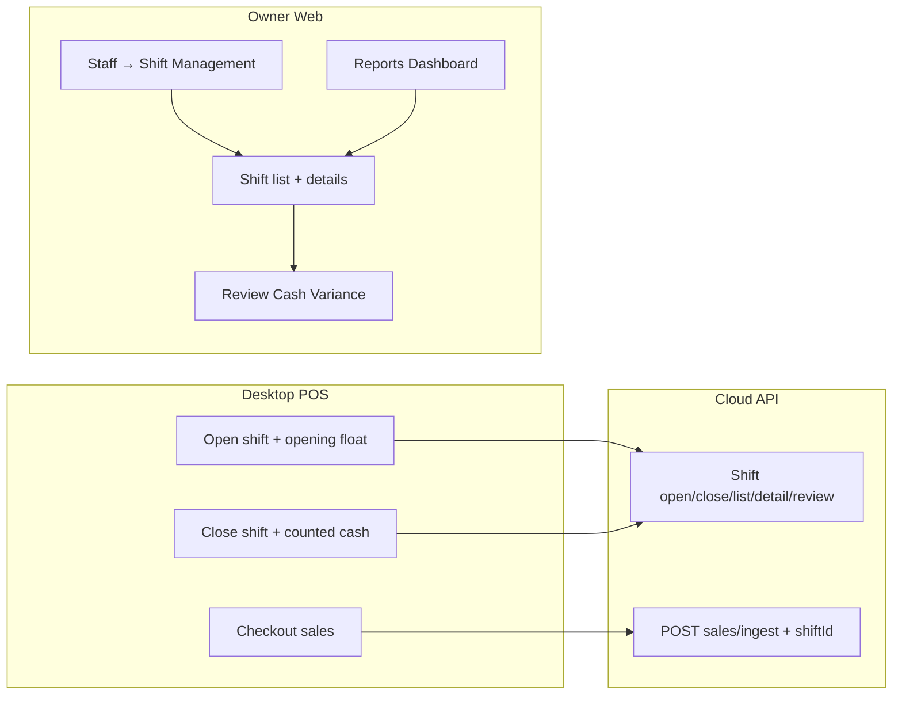

# M6 Slice 5 — Shifts + Reports Dashboard

## Recommendation: **Slice 5** (not append to Slice 4)

Slice 4 Staff **AN–AV is DONE** ([`MILESTONE_6_EXECUTION.md`](MILESTONE_6_EXECUTION.md)). Shift work is a new domain (cloud model + desktop migration + Reports nav). Keep it as **Slice 5** with batches **AW–BE**.

## Entry point (locked)

On [`StaffPage.tsx`](apps/web/src/features/staff/StaffPage.tsx), add a **secondary** header button beside **Add Staff**:

- Label: **Shift Management** (i18n)
- Route: `/staff/shifts`
- Breadcrumb: `Staff > Shifts` (list) · `Staff > Shifts > Shift Details` (detail)

Reports Dashboard links **Staff Activity** and **Shift Report** cards to the same `/staff/shifts` route.

## Screens in scope (use prior uploads)

| # | Screen | Route / surface |
|---|--------|-----------------|
| 1 | **Shift Management** (list) | `/staff/shifts` |
| 2 | **Shift Details** (Open) | `/staff/shifts/:shiftId` |
| 3 | **Shift Details** (Closed, balanced) | same |
| 4 | **Review Cash Variance** (modal) | on flagged shift |
| 5 | **Shift Details** (resolved variance) | same + Variance Review card |
| 6 | **Reports Dashboard** | `/reports` (enable Reports nav) |

**Out of this slice:** Audit & FEFO, Settings, Help, Owner Profile; Sales/Inventory/Purchase **report detail pages** (View Report links **disabled**); Manifest Details (AC) still deferred.

## Current gap (why this slice is large)

| Layer | Today | Slice 5 target |
|-------|--------|----------------|
| Prisma | No `Shift` model; `Sale` has no `shiftId` | Cloud shift + variance review |
| Desktop | [`shiftStore.ts`](apps/desktop/src/lib/shiftStore.ts) localStorage only; no float/count | Cloud open/close + float + counted cash |
| Owner web | Staff done; Reports nav `live: false` | Shifts UI + Reports dashboard |
| Dashboard API | `openShifts` / `cashVarianceToday` = `null` | Live from Shift tables |



## Locked product rules

- **Live data only** — no decorative sample rows (৳2,45,600, Sarah W., etc.).
- **Payments:** CASH \| CARD \| MFS only; expected cash = `openingFloat + sum(CASH payments)` for sales in shift window.
- **Variance:** `countedCash − expectedCash`; non-zero on close → **FLAGGED** until Owner resolves.
- **Shift ID display:** server-generated `shiftNo` like `SH-260814-A` (date + daily sequence per tenant/store).
- **Statuses:** `OPEN` \| `CLOSED` \| `FLAGGED` (flagged = closed with unresolved variance).
- **Single store** (Phase 1): branch filter = current store only; chrome branch switcher stays disabled.
- **OWNER-only** Owner web; cashiers use desktop for open/close.
- **One open shift per cashier per store** (second open → 409).
- **Self-lockout:** unchanged from Staff slice.

### Parked controls (disable — do not invent backends)

| Control | Behavior |
|---------|----------|
| Request Cash Count | Disabled + hint |
| Generate Shift Report | Disabled |
| Reports: Sales / Inventory / Purchase **View Report** | Disabled (detail pages not shared) |
| Export / Print on shift list | Disabled |

### Wired controls

| Control | Destination |
|---------|-------------|
| View POS Activity | `/sales` with `cashierId` + shift date range query params |
| View Shift Reports (Reports) | `/staff/shifts` |
| Shift Report card (Reports) | `/staff/shifts` |
| Review (flagged row) | Opens Review Cash Variance modal |

## Data model (Batch AW — additive)

New enum `ShiftStatus`: `OPEN` \| `CLOSED` \| `FLAGGED`

New enum `ShiftVarianceDecision`: `ACCEPTED_DIFFERENCE` \| `COUNT_CORRECTED` \| `OTHER`

**`Shift`** (tenant-scoped):

- `id`, `tenantId`, `storeId`, `userId` (cashier)
- `shiftNo` String (unique per tenant)
- `status` ShiftStatus
- `openingFloat` Decimal
- `openedAt`, `closedAt?`
- `countedCash?` Decimal
- `expectedCash?` Decimal (snapshot at close)
- `variance?` Decimal
- `cashSales`, `cardSales`, `mfsSales`, `txnCount` (snapshots at close; live-computed while OPEN)
- Variance review: `varianceDecision?`, `varianceNote?`, `adjustmentReference?`, `reviewedAt?`, `reviewedByUserId?`
- `createdAt`, `updatedAt`

**`ShiftActivityEvent`** (optional lightweight audit timeline): `OPENED`, `SALE_RECORDED`, `CLOSE_SUBMITTED`, `VARIANCE_REVIEWED`, `CLOSED`

**`Sale`:** optional `shiftId` FK (set on ingest when cashier has OPEN shift for store).

Seed: 1 OPEN, 1 CLOSED balanced, 1 FLAGGED unresolved, 1 FLAGGED resolved — with linked sales for walkthrough.

## API surface (Batch AX)

### Cashier / Manager (desktop)

| Method | Path | Purpose |
|--------|------|---------|
| `POST` | `/api/v1/shifts/open` | `openingFloat` required; returns active shift |
| `POST` | `/api/v1/shifts/:id/close` | `countedCash` required; computes variance; FLAGGED if ≠ 0 |
| `GET` | `/api/v1/shifts/active` | Current user's open shift for JWT store |

### Owner (web)

| Method | Path | Purpose |
|--------|------|---------|
| `GET` | `/api/v1/owner/shifts` | Paged list + KPIs (open, closed today, variance today, flagged 7d) + filters |
| `GET` | `/api/v1/owner/shifts/:id` | Detail + payment breakdown + activity timeline |
| `POST` | `/api/v1/owner/shifts/:id/resolve` | Owner review modal payload → CLOSED + audit |

Extend `POST /sales/ingest` (+ sync ingest): attach `shiftId` when opener has OPEN shift (reject sale if no open shift — aligns with F2 soft gate).

Extend `GET /owner/dashboard` staff block: `openShifts`, `cashVarianceToday` from Shift tables.

New `GET /api/v1/owner/reports/dashboard` (or extend dashboard with `?surface=reports`) for Reports page widgets: reuse sales/inventory/purchasing aggregates + staff/shift KPIs + recent activity (shift reviews + report views if tracked, else shift/sales facts only).

Zod in [`packages/shared-types`](packages/shared-types/src); catalog **§25** at exit.

## Desktop POS (Batch AY)

Replace local-only [`shiftStore`](apps/desktop/src/lib/shiftStore.ts) persistence with **cloud-first** (cache open shift in localStorage for offline badge only):

- **Open Shift:** modal/step for **opening float** (required, ৳) → `POST /shifts/open` (online required for open/close).
- **Close Shift:** **counted cash** (required) → `POST /shifts/:id/close`.
- **Soft gate F2:** require cloud OPEN shift (fallback: show Shift panel).
- **Offline sales:** queue ingest with `shiftId` captured at sale time from cached open shift; block new sale if no cached open shift.
- Update [`ShiftPanel.tsx`](apps/desktop/src/features/shift/ShiftPanel.tsx) + i18n (`apps/desktop` en + bn-BD).
- `smoke:m3shift` or extend `smoke:m3al` for open → sale → close path.

## Owner web UI batches

| Batch | Title | Depends | Re-share |
|-------|-------|---------|----------|
| **AW** | Prisma + Zod + seed | Slice 4 AV | No |
| **AX** | Shift APIs + ingest shiftId + dashboard shift KPIs | AW | No |
| **AY** | Desktop cloud shift (float + count) | AX | Invent (extend Shift panel family) |
| **AZ** | Staff Shift Management button + shifts list | AX | **Shift Management** — prior upload |
| **BA** | Shift Details (Open + Closed balanced) | AZ | **Shift Details** open/closed — prior upload |
| **BB** | Review Cash Variance modal + resolved details | BA | **Review modal + finalized details** — prior upload |
| **BC** | Enable Reports nav + Reports Dashboard | AX | **Reports Dashboard** — prior upload |
| **BD** | Slice 5 exit (docs + §25 + smoke:m6s5) | AW–BC | No |

Order: **AW → AX → AY → AZ → BA → BB → BC → BD**.

## Reports Dashboard scope (Batch BC)

Enable [`nav.ts`](apps/web/src/features/shell/nav.ts) `reports` `live: true`, path `/reports`.

**Live widgets** (honest aggregates from existing + new APIs):

- Top KPIs: Total Sales, Purchase Value (PO totals), Inventory Value, Active Staff + open-shifts warning
- Sales Overview chart (reuse dashboard sales series pattern)
- Inventory Status / Purchasing summary (reuse owner inventory + PO KPIs)
- **Staff Activity** (Active / Open / Closed / Flagged from shift KPIs)
- **Recent Activity** (shift opened/closed/variance reviewed + existing sales views if cheap)

**Parked:** Sales Report / Inventory Report / Purchase Report **View Report →** disabled.

## Implementation leverage

- Staff list pattern: [`apps/web/src/features/staff/StaffPage.tsx`](apps/web/src/features/staff/StaffPage.tsx)
- Dashboard widgets: [`apps/web/src/features/dashboard/DashboardPage.tsx`](apps/web/src/features/dashboard/DashboardPage.tsx)
- Owner routing: [`ownerPath.ts`](apps/web/src/lib/ownerPath.ts), [`AppShell.tsx`](apps/web/src/features/shell/AppShell.tsx)
- Sales filter link: existing [`SalesPage`](apps/web/src/features/sales/SalesPage.tsx) query params

## Docs update (Batch BD)

Append **Slice 5 — Shifts + Reports** to [`MILESTONE_6_EXECUTION.md`](MILESTONE_6_EXECUTION.md); update [`Current_Status.md`](Current_Status.md), [`PROJECT_MASTER_PLAN.md`](PROJECT_MASTER_PLAN.md), [`ROLES_AND_PERMISSIONS.md`](ROLES_AND_PERMISSIONS.md) (Owner shift review + cloud shift for Manager/Cashier on desktop).

## Fresh-chat command (per batch)

```text
@PROJECT_MASTER_PLAN.md @Current_Status.md @ROLES_AND_PERMISSIONS.md @MILESTONE_6_EXECUTION.md @Completed_API_lists.md

Authorize M6 Batch AW.
Implement ONLY that batch. One batch only.
When done, paste the short M6 Batch report.
```

For UI batches AZ–BC add: `Use prior upload for the named screen.`

## Execution gate

Do **not** implement until user says **Authorize M6 Batch AW**. One batch per chat.
