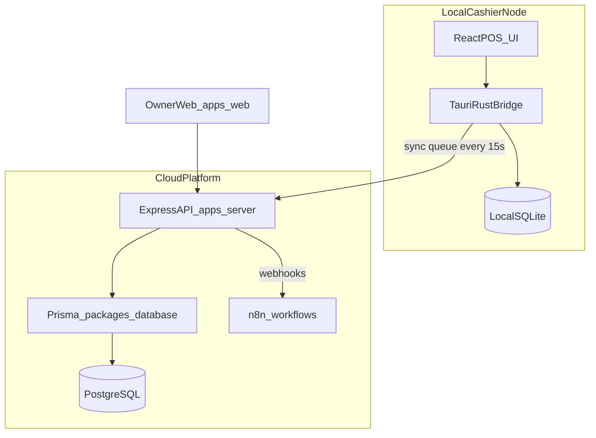

# Pharmacy POS — Audit, Structure & Master Execution Plan

## 1. Existing Backend Audit

**Location:** [`r2a-pharma-backend/`](r2a-pharma-backend/) (not `backend/`). [`r2a-pharma-frontend/`](r2a-pharma-frontend/) is empty.

### What exists today
A thin **Express + Mongoose (MongoDB)** auth scaffold in plain JS ESM:

| Area | Reality |
|------|---------|
| API surface | `GET /`, `GET /api/v1/health`, `POST /auth/register`, `POST /auth/login`, `GET /users`, `GET /users/me` |
| Domain model | Single `User` with roles `customer` / `provider` / `admin` |
| Auth | JWT (`sub`, `role`) + bcrypt — **no `tenant_id`** |
| Pharmacy POS | Missing entirely (products, batches, sales, sync, n8n, SQLite, Tauri) |

### Patterns worth preserving (port into TypeScript)
- Module layering: `router → controller → service` ([`src/modules/auth/`](r2a-pharma-backend/src/modules/auth/), [`src/modules/user/`](r2a-pharma-backend/src/modules/user/))
- Versioned mount `/api/v1` ([`src/app.js`](r2a-pharma-backend/src/app.js))
- `catchAsync`, `AppError`, `globalError`, `sendResponse` envelope
- `protect` + `restrictTo` middleware shape ([`src/middlewares/auth.js`](r2a-pharma-backend/src/middlewares/auth.js))
- Required-env loader, health check, graceful process handlers

### Obsolete / conflicting — do not extend
- **MongoDB/Mongoose** vs required Prisma + PostgreSQL (+ local SQLite)
- Marketplace roles vs pharmacy RBAC (`OWNER`, `MANAGER`, `CASHIER`, `SUPER_ADMIN`)
- Hardcoded seed credentials, unprotected `GET /users`, no `.gitignore`, placeholder package name `"my-code-structure"`
- Empty frontend folder and stack mismatch with [Project_Handover.md](Project_Handover.md)

**Decision (locked):** Treat `r2a-pharma-backend` as a **pattern reference only**. Greenfield `apps/server` + `packages/database` on Prisma/PostgreSQL. Move the old folder to `legacy/r2a-pharma-backend` after pattern port, then delete when the new auth module is verified. Do not migrate Mongo schemas.

---

## 2. Proposed Monorepo Structure

Follow the handover blueprint: **Turborepo + npm workspaces**. Root stays `R2A-Pharmacy-POS`.

```text
R2A-Pharmacy-POS/
├── apps/
│   ├── desktop/                 # Tauri + Vite + React POS (cashier)
│   │   ├── src-tauri/           # Rust: SQLite, sync worker, printer IPC
│   │   └── src/                 # React POS UI (3-panel, keyboard-first)
│   ├── web/                     # Owner dashboard (Vite + React; Phase 2 UI)
│   └── server/                  # Express + TS multi-tenant Cloud API
├── packages/
│   ├── database/                # Prisma schema, migrations, client export
│   │   └── prisma/schema.prisma
│   ├── shared-types/            # Zod DTOs, API contracts, sync event types
│   └── ui/                      # Shared Tailwind + Shadcn primitives
├── workflows/                   # n8n JSON workflow contracts (Phase 2)
├── legacy/                      # Archived r2a-pharma-backend (temporary)
├── docs/                        # Existing PRD / Architecture / UX / Handover
├── package.json                 # npm workspaces root
├── turbo.json
└── .gitignore
```

### Architecture blueprint



### Locked technical decisions
| Topic | Choice | Rationale |
|-------|--------|-----------|
| Monorepo | Turborepo + npm workspaces | Matches handover |
| Cloud API | Express + TypeScript | Continuity with existing patterns; handover default |
| Multi-tenancy | Shared Postgres + `tenant_id` on all domain tables; JWT carries `tenantId` | Handover canonical; RLS policies added in Phase 2 |
| Phase 1 tenancy | Schema is tenant-ready; MVP operates as single-store per tenant | Matches Architecture Milestone 1 |
| Local DB | SQLite via Tauri (`pos_local.db` + `outbound_sync_queue`) | Offline checkout |
| Owner UI | `apps/web` scaffolded early; full dashboard in Phase 2 | POS is Phase 1 priority |
| Docs | Keep current MD files under `docs/` (optional rename later) | Avoid doc churn before code |

### Core Prisma entities (Phase 1 foundation)
`Tenant`, `Store`, `User` (pharmacy roles), `Product`, `ProductUnit` (box/strip/piece factors), `Batch` (expiry, cost, qty in base units), `Customer`, `Sale`, `SaleItem`, `Payment` (cash/MFS/baki), plus sync ingest audit fields. Stock stored in **lowest unit**; billing converts units. FEFO = nearest `expiryDate` with `qty > 0`.

### Sync rules (non-negotiable)
- Sales: append-only, immutable
- Stock: delta pushes (`quantity_change`), never absolute overwrite
- Local queue table as specified in handover; worker flush every 15s when online

---

## 3. Master Execution & Milestone Plan

Aligned to PRD Phases + Architecture milestones + Handover Steps 1–4.

### Milestone 0 — Workspace hygiene (Day 0)
- Init gitignore (exclude `.env`, `node_modules`, `dist`, Tauri targets)
- Scaffold Turborepo root, workspaces, `turbo.json`
- Move `r2a-pharma-backend` → `legacy/`; remove empty `r2a-pharma-frontend`
- Relocate specs into `docs/`

### Milestone 1 — Monorepo & Database Foundation
**Handover Step 1 | PRD Phase 1 foundation**

- Create `packages/database` with full Prisma schema (entities above + indexes on `tenantId`, product search fields, batch expiry)
- Create `packages/shared-types` (Zod: auth, product, sale, sync event)
- Seed script: owner user + sample pharmacy catalog (pre-loaded drugs)
- Document env template: `DATABASE_URL`, `JWT_SECRET`, etc.

**Exit criteria:** `prisma migrate` applies cleanly; seed loads tenant/store/products/batches.

### Milestone 2 — Cloud API Core (`apps/server`)
**Handover Step 2**

Port patterns from legacy into TS Express:
- `/api/v1` versioning, `AppError` / `catchAsync` / response envelope
- Auth: register/login, JWT with `{ sub, role, tenantId, storeId }`
- Middleware: `protect`, `restrictTo`, **tenant context guard** on every domain query
- CRUD: Products, Batches, Customers; Sales ingest endpoint; Generic substitute lookup by active ingredient
- FEFO helper in service layer (shared contract for desktop later)
- Health + structured logging

**Exit criteria:** Authenticated API can create inventory and ingest a sale with FEFO batch assignment; cashier cannot see margins.

### Milestone 3 — Desktop POS Shell (`apps/desktop`)
**Handover Step 3 | UX Spec Screen 1**

- Bootstrap Tauri + Vite + React + TS + Tailwind + Shadcn (`packages/ui`)
- 3-panel POS layout per [UX_Specification.md](UX_Specification.md): search (40%) | cart + checkout (60%)
- Keyboard map: `Ctrl+K` search, `F2` new bill, `F4` generics, `F8` customer, `Enter`/`F10` complete+print, `Esc` clear
- Online path: call Cloud API for search/checkout when connected
- Local SQLite schema + Tauri commands for offline write path
- Offline/online badge in header
- Thermal print stub (80mm) via Tauri IPC (real driver polish can trail UI)

**Exit criteria:** Full keyboard checkout online; offline sale persists to SQLite + sync queue; search feels snappy (target &lt;50ms local).

### Milestone 4 — One-way Sync Worker
**Handover Step 4 (partial) | Architecture Phase 1 sync**

- Tauri background task: ping API every 15s, FIFO flush of `outbound_sync_queue`
- Cloud `POST /api/v1/sync/ingest` applying append-only sales + stock deltas idempotently (`event_id`)
- Retry/backoff + dead-letter flag for poison events

**Exit criteria:** Complete a sale offline → reconnect → sale and stock deltas appear in Postgres without duplicates.

### Milestone 5 — MVP Hardening & Pilot Ready
**PRD Phase 1 complete**

- Owner vs Cashier RBAC enforced end-to-end
- Purchase/stock entry for batches
- Cash + MFS + Baki (customer due) on checkout
- Receipt print path validated on one target printer
- Seeded drug master usable in real counter flow
- Basic smoke tests for auth, FEFO, sync ingest
- Runbook: local dev (Postgres via Docker), desktop build notes

**MVP ship gate:** Single-store pharmacy can sell online/offline with FEFO, basic inventory, and cloud sales visibility via API (minimal owner views can be API/Postman until web UI).

---

### Milestone 6 — Growth: Bi-directional Sync, Loyalty, n8n (PRD Phase 2)
- Cloud → local catalog/stock pull; conflict rules for non-sale entities
- Loyalty points earn/redeem; chronic refill events
- Supplier return bucket (90-day expiry)
- `workflows/`: webhook emitters from API → n8n (WhatsApp/SMS refill, PO dispatch)
- `apps/web`: owner analytics, staff, automation settings
- Postgres RLS policies for defense-in-depth

### Milestone 7 — Scale: Multi-branch & Enterprise (PRD Phase 3)
- Multi-store under one tenant; inter-branch transfers
- Fine-grained RBAC (Manager tier, Super Admin platform)
- AI/analytics summaries via n8n; supplier B2B hooks

---

## 4. Suggested Execution Order (Immediate Next Work)

After you approve this plan, first implementation slice:

1. Milestone 0 scaffolding (Turborepo, gitignore, legacy move)
2. Milestone 1 Prisma schema + migrate + seed
3. Milestone 2 auth + tenant middleware + product/batch/sale APIs
4. Then desktop shell (Milestone 3) in parallel with API completion where possible

No application code or structural file writes will happen until you explicitly approve this plan.