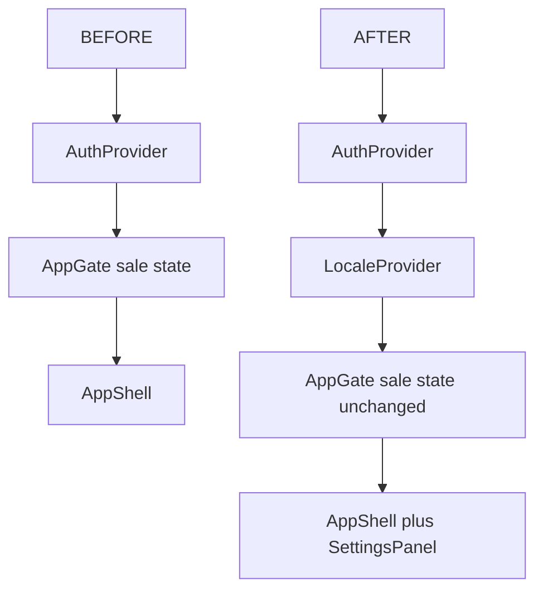

# M3 UI Localization — Slice 1

## Scope lock

- Infrastructure + Settings language UI + shell labels only.
- No i18next, no backend/schema, no POS modals, no receipts, no Login migration, no App.tsx toast sweep, no `qtyPackaging`.

## A. Files to ADD

| Path | Role |
|------|------|
| [`apps/desktop/src/i18n/types.ts`](apps/desktop/src/i18n/types.ts) | `UiLocale = "bn-BD" \| "en"`; typed message tree |
| [`apps/desktop/src/i18n/locales/bn-BD.ts`](apps/desktop/src/i18n/locales/bn-BD.ts) | Default dictionary |
| [`apps/desktop/src/i18n/locales/en.ts`](apps/desktop/src/i18n/locales/en.ts) | English dictionary (same keys) |
| [`apps/desktop/src/i18n/messages.ts`](apps/desktop/src/i18n/messages.ts) | `Record<UiLocale, Messages>` + typed `t` helper over nested keys |
| [`apps/desktop/src/i18n/localeStore.ts`](apps/desktop/src/i18n/localeStore.ts) | `localStorage` get/set (mirror [`tokenStore.ts`](apps/desktop/src/lib/tokenStore.ts)) |
| [`apps/desktop/src/i18n/LocaleProvider.tsx`](apps/desktop/src/i18n/LocaleProvider.tsx) | Context: `locale`, `setLocale`, `t`; **no `key=` on children** |
| [`apps/desktop/src/i18n/index.ts`](apps/desktop/src/i18n/index.ts) | Public exports |
| [`apps/desktop/src/features/settings/SettingsPanel.tsx`](apps/desktop/src/features/settings/SettingsPanel.tsx) | Small panel: title + Interface Language + `[বাংলা]` / `[English]` |

## B. Files to MODIFY

| Path | Change |
|------|--------|
| [`apps/desktop/src/App.tsx`](apps/desktop/src/App.tsx) | Wrap `AppGate` with `LocaleProvider` under `AuthProvider`; add settings-open state + overlay (or pass into shell) |
| [`apps/desktop/src/features/shell/AppShell.tsx`](apps/desktop/src/features/shell/AppShell.tsx) | Accept `onOpenSettings` / render `SettingsPanel` overlay when open |
| [`apps/desktop/src/features/shell/Sidebar.tsx`](apps/desktop/src/features/shell/Sidebar.tsx) | `t()` for nav labels; Settings → `onOpenSettings` (not `showComingSoon`) |
| [`apps/desktop/src/features/shell/Header.tsx`](apps/desktop/src/features/shell/Header.tsx) | `t()` for static chrome only (e.g. `CASHIER:`); keep brand `PharmaSync POS` and terminal/cashier **values** |
| [`apps/desktop/src/features/shell/Footer.tsx`](apps/desktop/src/features/shell/Footer.tsx) | `t()` for static shortcut labels (`New Sale`, `Search`, `Customer`, `Cancel`, `READY`, `SYSTEM BUSY`) |
| [`apps/desktop/src/features/shell/connectivityTypes.ts`](apps/desktop/src/features/shell/connectivityTypes.ts) | Return **semantic** label keys (e.g. `checking`, `online_synced`) instead of English display strings; keep pure (no hooks) |
| [`apps/desktop/src/features/shell/ConnectivityBadge.tsx`](apps/desktop/src/features/shell/ConnectivityBadge.tsx) | Map semantic status → `t("connectivity.*")` at display boundary |
| [`apps/desktop/src/features/shell/index.ts`](apps/desktop/src/features/shell/index.ts) | Export only if Settings wiring needs it (minimal) |

**Do not modify:** `receiptModel.ts`, POS modals, `LoginPage`, `qtyPackaging.ts`, payment/sale-completed paths.

## C. Provider hierarchy



- `LocaleProvider` is a **child of** `AuthProvider` (needs `user.id`) and **parent of** `AppGate`.
- Locale updates = context re-render only. Never `key={locale}` / `key={userId}` on `AppGate` or `AppShell`.

## D. Locale persistence (from real session shape)

[`SessionUser`](apps/desktop/src/features/auth/sessionUser.ts) has stable `id: string`.

| Condition | Storage key |
|-----------|-------------|
| Authenticated and `user.id` non-empty | `pharmasync.uiLocale.<userId>` |
| Else (loading / logged out / empty id) | `pharmasync.uiLocale` (device fallback) |

- Default when missing/invalid: **`bn-BD`**.
- On login (user id appears): load user-scoped value (fallback → device key → `bn-BD`); do not remount gate.
- `setLocale`: write current scoped key; update context state only.
- No DB/backend writes.

## E. Translation-key structure (this slice only)

Typed nested maps in TS (both locales share one `Messages` type):

```
settings.title
settings.interfaceLanguage
settings.localeBn
settings.localeEn
sidebar.newSale
sidebar.transactions
sidebar.shift
settingsNav / sidebar.settings
sidebar.support
sidebar.help
sidebar.logout
sidebar.cashierPrefix   // "Cashier:"
header.cashierPrefix    // "CASHIER:"
footer.newSale
footer.search
footer.customer
footer.cancel
footer.ready
footer.systemBusy
connectivity.checking
connectivity.onlineSynced
connectivity.onlineSyncing
connectivity.onlinePending   // interpolate pending count with Latin digits
connectivity.offline
connectivity.error
```

Leave brand, terminal id, cashier name, version string, and domain data untranslated.

## F. Implementation order (max 6)

1. Add `i18n/` types + `bn-BD`/`en` maps + `messages` + `localeStore`.
2. Add `LocaleProvider`; wrap in `App.tsx` under `AuthProvider` above `AppGate`.
3. Add `SettingsPanel`; wire open/close from Sidebar via `AppShell`/`AppGate` (replace Settings coming-soon).
4. Translate Sidebar + Settings copy with `t()`.
5. Translate Header/Footer static labels; refactor `connectivityTypes` → semantic keys + translate in `ConnectivityBadge`.
6. Verify: switch language mid-sale; confirm cart/customer/modals intact; receipt untouched.

## G. Verification

- `npm run lint -w @r2a/desktop` (tsc)
- Manual: login → New Sale → add line → open Settings → switch bn-BD ↔ en → labels flip; cart/customer/modal state unchanged; receipt preview text unchanged if opened after a sale.
- Confirm `localStorage` key `pharmasync.uiLocale.<userId>` updates; reload keeps choice.
- Confirm Settings no longer alerts “coming soon”.

## H. Remount / state-reset risks

| Risk | Mitigation |
|------|------------|
| `key={locale}` or `key={user.id}` on `AppGate`/`AppShell` | Forbidden — context-only updates |
| Putting sale state inside a locale-keyed child | Keep all sale state in `AppGate`; locale only in provider above |
| Reloading locale by replacing entire `App` tree on `setLocale` | `setState` in provider only |
| Closing Settings clearing sale | Settings is overlay; must not call cancel-sale / reset handlers |

Out of scope for this slice: full POS string migration, pharmacy-header Settings, real printer/card/MFS, M4.