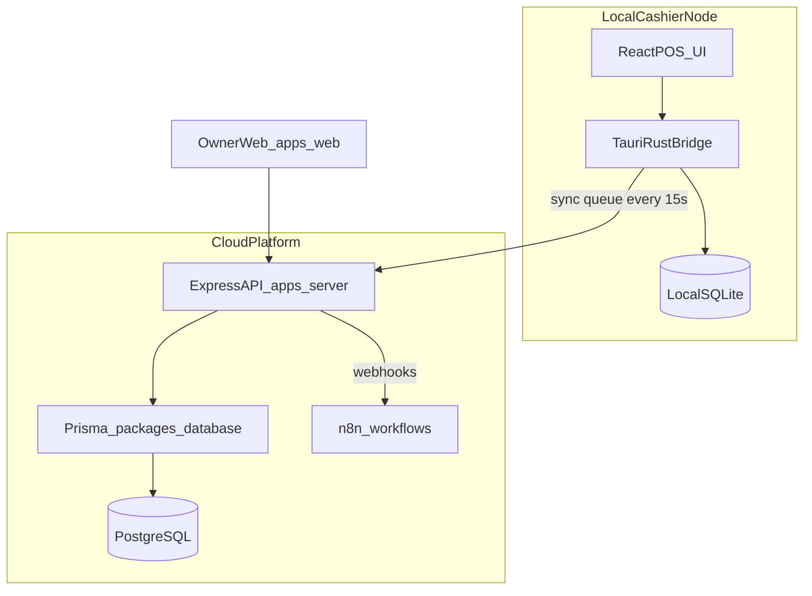

# R2A Pharmacy POS — Project Master Plan (AI Agent Context)

**Document type:** Single source of truth for Cursor agents and engineers  
**Project:** Multi-Tenant Pharmacy POS & Inventory SaaS  
**Version:** 1.0.0  
**Last updated:** 2026-08-13  

> **How to use in a fresh chat:** Attach or `@` this file (`PROJECT_MASTER_PLAN.md`) plus relevant docs under `docs/`. Follow milestones in order. Do not introduce MongoDB, Mongoose, or any stack outside the Tech Stack below.

---

## 1. Product Goal

Build a production-grade, **offline-first**, multi-tenant Pharmacy Point of Sale and Inventory SaaS for Bangladesh / emerging markets:

- Sub-50ms local drug search / checkout feel
- Batch-wise expiry tracking with **FEFO** (First Expired, First Out)
- Multi-unit pricing (Box / Strip / Piece)
- Keyboard-first cashier POS
- Cloud PostgreSQL system of record + local SQLite on desktop
- n8n automation (WhatsApp / SMS refill alerts) from Phase 2 onward

### Detailed specs (source docs)

| Doc | Path |
|-----|------|
| Handover / stack contract | [docs/Project_Handover.md](docs/Project_Handover.md) |
| Product requirements (PRD) | [docs/Project_Requirement_Documents.md](docs/Project_Requirement_Documents.md) |
| System architecture | [docs/System_Architecture_Technical_Specification.md](docs/System_Architecture_Technical_Specification.md) |
| UI / UX specification | [docs/UX_Specification.md](docs/UX_Specification.md) |

---

## 2. Canonical Tech Stack (LOCKED)

| Layer | Technology |
|-------|------------|
| Monorepo | Turborepo + npm workspaces |
| Desktop | Tauri (Rust) + React + TypeScript + Vite |
| Web (owner) | React + TypeScript + Tailwind + Shadcn UI |
| Cloud API | Node.js + TypeScript + **Express** |
| ORM / Cloud DB | **Prisma** + **PostgreSQL** |
| Local offline DB | **SQLite** (`pos_local.db`) via Tauri |
| Automation | Self-hosted **n8n** + webhooks |
| Icons / UI | Lucide React, high-density clinical layout |

### Forbidden / removed stacks

Do **not** add or reintroduce:

- MongoDB, Mongoose, or any document-DB ORM
- Competing backend frameworks unless explicitly approved (stick to Express)
- Parallel frontend apps outside `apps/desktop` and `apps/web`

The previous Express + Mongoose scaffold (`r2a-pharma-backend`) was **deleted in Milestone 0**. Useful patterns to re-implement in TypeScript (Milestone 2):

- Module layering: `router → controller → service`
- API prefix `/api/v1`
- Helpers: `AppError`, `catchAsync`, `sendResponse` envelope
- Middleware shape: `protect` + `restrictTo` (extend with `tenantId` from JWT)

---

## 3. Monorepo Structure

```text
R2A-Pharmacy-POS/
├── apps/
│   ├── desktop/          # Tauri + React cashier POS
│   ├── web/              # Owner dashboard (Phase 2 UI focus)
│   └── server/           # Express + TS cloud API
├── packages/
│   ├── database/         # Prisma schema + migrations + client
│   │   └── prisma/
│   ├── shared-types/     # Zod DTOs / API + sync contracts
│   └── ui/               # Shared Tailwind / Shadcn components
├── workflows/            # n8n workflow JSON contracts (Phase 2)
├── docs/                 # PRD, Architecture, UX, Handover
├── package.json          # npm workspaces root
├── turbo.json
├── tsconfig.base.json
├── .env.example
└── PROJECT_MASTER_PLAN.md   # THIS FILE
```

### Workspace package names

| Package | npm name |
|---------|----------|
| Cloud API | `@r2a/server` |
| Desktop POS | `@r2a/desktop` |
| Owner web | `@r2a/web` |
| Prisma DB | `@r2a/database` |
| Shared types | `@r2a/shared-types` |
| Shared UI | `@r2a/ui` |

---

## 4. Architecture Blueprint



### Multi-tenancy (locked)

- Shared PostgreSQL with **`tenant_id`** on every domain table
- JWT must embed `tenantId` (and usually `storeId`, `role`, `sub`)
- Every cloud query scoped by `tenant_id` from JWT — never from client body alone
- Postgres RLS policies: Phase 2 defense-in-depth
- Phase 1 MVP: tenant-ready schema, single-store per tenant operations

### Offline sync (locked)

Local queue table:

```sql
CREATE TABLE outbound_sync_queue (
  id TEXT PRIMARY KEY,
  entity_type TEXT NOT NULL,
  action TEXT NOT NULL,
  payload TEXT NOT NULL,
  synced INTEGER DEFAULT 0,
  created_at DATETIME DEFAULT CURRENT_TIMESTAMP
);
```

Conflict rules:

- **Sales / invoices:** append-only, immutable
- **Stock:** delta sync only (`quantity_change`), never absolute overwrite
- Background worker pings cloud every **15s** and flushes FIFO

---

## 5. Non-Negotiable Business Rules

1. **FEFO:** POS recommends the nearest-expiring **non-expired** batch with stock > 0 (search card + Select Batch highlight). Expired lots may still appear in the batch picker but are not sellable. Manual override of FEFO needs permission (later). Cloud `GET …/fefo-batch` / ingest FEFO-fill pick earliest in-stock by expiry (may include expired) — desktop sellable preference is documented in `Completed_API_lists.md` §8.5.
2. **Multi-unit pricing:** Store quantities in lowest unit (e.g. tablets). Convert Box/Strip/Piece at billing. Example: 1 Box = 10 Strips = 100 Tablets.
3. **Keyboard-first POS:** Must work without a mouse.
   - `Ctrl+K` / `/` — focus search  
   - `F2` — new bill  
   - `F4` — generic substitution modal  
   - `F6` — Hold / park active sale  
   - `F7` — Held sales list (toggle)  
   - `F8` — customer / loyalty  
   - `Enter` / `F10` — complete sale + print  
   - `Esc` — clear cart / close modal  
   - `←` `→` (or `↑` `↓` on CTAs) — switch focused modal actions  
   - **`Tab` is never a POS navigator** — ignore Figma Tab hints; use arrows instead
4. **RBAC:**
   - **Cashier:** blocked from margins, base price edits, deleting sales, admin reports
   - **Owner:** full financials, reports, n8n settings
   - Later: Manager, Super Admin (Phase 3)

### UX design tokens (cashier)

- Primary: Teal `#0D9488`
- Accent: Indigo `#4F46E5`
- Background: Slate-50 `#F8FAFC`
- Night: Slate-900 `#0F172A`
- Expiry badges: red ≤30d, yellow ≤90d, green >90d
- Layout: 3-panel POS — search ~40% | cart + checkout ~60% (**locked**; do not follow Figma that shrinks the cart — see `Current_Status.md` §12 Active Cart lock)

---

## 6. Core Domain Model (Prisma — Milestone 1)

Minimum entities:

`Tenant`, `Store`, `User`, `Product`, `ProductUnit`, `Batch`, `Customer`, `Sale`, `SaleItem`, `Payment`

Plus sync ingest identity (`event_id` / idempotency) for offline events.

Roles (pharmacy, not marketplace): `SUPER_ADMIN` | `OWNER` | `MANAGER` | `CASHIER`

---

## 7. Milestone Execution Plan

Track status in this table. Agents must only implement the milestone the user authorizes.

| ID | Milestone | Status | Summary |
|----|-----------|--------|---------|
| M0 | Workspace hygiene | **DONE** | Turborepo scaffold, gitignore, docs/, delete Mongo backend |
| M1 | Database foundation | **DONE** | Prisma schema, migrations, seed, `@r2a/shared-types` |
| M2 | Cloud API core | **DONE** | Express TS auth, tenant guard, inventory, FEFO, sales ingest |
| M3 | Desktop POS shell | **DONE** | Slice 1–6; later screens → Slice 7+. See `MILESTONE_3_EXECUTION.md` |
| M4 | One-way sync | **IN PROGRESS** | Batches A–D DONE (queue IPC + `/sync/ingest` + offline complete + 15s worker). E–F: Sync Queue UI |
| M5 | MVP hardening | PENDING | RBAC E2E, payments, print stub, smoke tests, runbook |
| M6 | Growth (Phase 2) | PENDING | Bi-di sync, loyalty, n8n, owner web, RLS |
| M7 | Scale (Phase 3) | PENDING | Multi-branch, transfers, enterprise RBAC |

---

### Milestone 0 — Workspace hygiene (DONE)

Completed:

- [x] Root Turborepo + npm workspaces (`package.json`, `turbo.json`, `tsconfig.base.json`)
- [x] Apps placeholders: `apps/desktop`, `apps/server`, `apps/web`
- [x] Packages placeholders: `packages/database`, `packages/shared-types`, `packages/ui`
- [x] `workflows/` for future n8n contracts
- [x] `.gitignore`, `.env.example`
- [x] Specs moved to `docs/`
- [x] **Deleted** `r2a-pharma-backend` (MongoDB/Mongoose) and empty `r2a-pharma-frontend`
- [x] This master plan file created

---

### Milestone 1 — Monorepo & Database Foundation (DONE)

Completed:

- [x] Create full `packages/database/prisma/schema.prisma` (entities above + indexes on `tenantId`, search fields, batch expiry)
- [x] Create `packages/shared-types` Zod schemas (auth, product, sale, sync event)
- [x] Seed: owner user + sample drug catalog / batches
- [x] Env: `DATABASE_URL`, `JWT_SECRET` (see `.env.example`)

**Exit:** `prisma migrate` applies; seed loads tenant/store/products/batches. **Met.**

---

### Milestone 2 — Cloud API Core (`apps/server`) (DONE)

Detailed batches: [`MILESTONE_2_EXECUTION.md`](MILESTONE_2_EXECUTION.md) (A–H all green).  
API catalog: [`Completed_API_lists.md`](Completed_API_lists.md).

Completed:

- [x] Express + TypeScript; mount `/api/v1`; modular `router → controller → service`
- [x] Port patterns: `AppError`, `catchAsync`, `sendResponse`, `protect`, `restrictTo`
- [x] JWT payload: `{ sub, role, tenantId, storeId }` (+ hashed rotatable refresh tokens)
- [x] Tenant context middleware on all domain routes
- [x] CRUD: Products, Batches, Customers; staff create via `POST /api/v1/users`
- [x] `POST /api/v1/sales/ingest` + FEFO helper (`expiryDate` / `quantityOnHand`; optional `batchId`)
- [x] Generic substitute lookup by active ingredient
- [x] Health endpoint + structured logging (pino)
- [x] Response envelope: `{ status, message, data?, meta? }` (not `{ success: false, error: {...} }`)
- [x] Exit smoke: `npm run smoke:m2 -w @r2a/server` (13/13)

Out of M2 product surface (unchanged): Super Admin platform console; M4 `/sync/ingest`; Baki tender.

**Exit:** Authenticated sale ingest with FEFO; cashier cannot see margins. **Met** (2026-08-09).

---

### Milestone 3 — Desktop POS Shell (`apps/desktop`) (DONE)

Detailed batches: [`MILESTONE_3_EXECUTION.md`](MILESTONE_3_EXECUTION.md) (Slice 1–6; closed 2026-08-13 — user all-screens-done; later finds → Slice 7+).

- Tauri + Vite + React + TS + Tailwind + Shadcn (`@r2a/ui`)
- 3-panel layout per UX spec
- Full keyboard map
- Online: Cloud API; Offline: SQLite + queue
- Header online/offline sync badge
- Thermal print stub (80mm / 58mm preview) — real Tauri IPC still TODO

**Completed so far:**

- [x] Batch A: `@r2a/desktop` runnable (Vite + Tauri 2); Tailwind; `@r2a/ui` bootstrap; `VITE_API_BASE_URL`
- [x] Batch B: design tokens + AppShell chrome (Search Results - Napa)
- [x] Batch C: invented login + session (M2 auth/refresh/me); Logout wired; Counter Ready placeholder
- [x] Batch D: connectivity badge + online/offline mode (health probe)
- [x] Batch E: `pos_local.db` + lean catalog cache + `outbound_sync_queue`; IPC; online cache pull; pending count wired
- [x] Batch F–I: Counter Ready → Empty POS → Search → Select Batch
- [x] Batch J: Quantity & Packaging modal; stock-aware Piece/Strip/Box; Add → cart line
- [x] Batch K: Active Cart table (~40/60); Edit + Del; Clear/Cancel ConfirmDialog; Proceed toast only
- [x] Batch L: Slice 1 exit verification
- [x] Batch M: Edit Sale Item modal; Change Batch stub (Batch N)
- [x] Batch N: Change Batch (edit) + Manual FEFO Override warn; Request Auth stub (Batch O)
- [x] Batch O: Manager Authorization stub; stages FEFO override for Batch P
- [x] Batch P: Override Authorized Edit + cart Override badge/toast; `fefoOverride` on cart line
- [x] Batch Q: Remove Item Confirm (reusable ConfirmDialog)
- [x] Batch R: Select Customer F8 (no Baki; Create removed in AF; walk-in; M2 search)
- [x] Batch S: Redeem Loyalty + OTP stub (Continue without = right primary; any 6-digit OTP)
- [x] Batch T: Complete Sale zero-pay + Sale Completed + loyalty calc (ingest CASH ৳0)
- [x] Batch U: Slice 2 exit + `Completed_API_lists.md` §14
- [x] Batch V–Y: Payment Select Method + Cash + shared Sale Completed + print stub
- [x] Batch Z: Slice 3 exit + `Completed_API_lists.md` §15 + `smoke:m3z`
- [x] Batch AA: Receipt Preview (80/58, dynamic lines; Settings pharmacy header from AH)
- [x] Batch AB–AC: Card Payment stub + CARD ingest + Sale Completed Card
- [x] Batch AD: MFS bKash/Nagad/Rocket + invented confirm + MFS ingest
- [x] Batch AE: Slice 4 exit + `Completed_API_lists.md` §16 + `smoke:m3ae`
- [x] Batch AF: Create Customer removed from POS; `POST /customers` OWNER-only
- [x] Batch AG: Generic Substitutes [F4]
- [x] Batch AH: Settings Pharmacy / Receipt Header → Receipt Preview
- [x] Batch AI: Force Offline / Stay Offline (sticky)
- [x] Batch AJ–AK: Transactions List + Detail + Reprint (local log)
- [x] Batch AL: Shift Open/Close + Counter Ready; Slice 5 exit + §17 + `smoke:m3al`; soft gate New Sale on open shift
- [x] Batch AM: `heldSaleStore` + `HeldSaleSnapshot`; max 3 soft holds; localStorage; no Hold UI
- [x] Batch AN: Hold F6 + cart Hold / Held n/3; Held Sales list resume/discard; empty New Sale after park; stub recheck toast
- [x] Batch AO: soft resume recheck (strip/clamp); Hold aborts card/MFS stubs + epoch-guards ingest
- [x] Batch AP: Slice 6 exit + `Completed_API_lists.md` §18 + `smoke:m3ap`; **F7** Held list toggle

**Still later (hardening / deferred / next milestones):** real printer IPC, real card SDK, real MFS APIs (backend-confirmed status; no cashier Trx), cloud sales list / cloud shift API, Owner web Create Customer, M4 queue flush. Later POS screens → Slice 7+ when shared.

**Exit:** Keyboard checkout **online** **Met**. Local catalog cache + outbound queue **table** **Met**. Queue **flush** is **M4** (not this milestone). User closed M3 screens 2026-08-13.---

### Milestone 4 — One-way Sync Worker

- Tauri worker every 15s → flush `outbound_sync_queue` FIFO
- Cloud `POST /api/v1/sync/ingest` — append-only sales + stock deltas, idempotent by `event_id`
- Retry / backoff / dead-letter for poison events

**Exit:** Offline sale appears in Postgres after reconnect with no duplicates.

---

### Milestone 5 — MVP Hardening & Pilot Ready

- Owner vs Cashier RBAC end-to-end
- Purchase / stock entry for batches
- Cash + MFS + Baki (customer due)
- Receipt path on one target printer
- Pre-loaded drug master usable at counter
- Smoke tests: auth, FEFO, sync ingest
- Dev runbook (Postgres Docker, desktop build)

**MVP ship gate:** Single-store pharmacy sells online/offline with FEFO; cloud holds sales (owner UI can wait for M6).

---

### Milestone 6 — Growth (PRD Phase 2)

- Bi-directional sync (cloud catalog/stock → local)
- Loyalty points earn/redeem; refill events
- Supplier return bucket (≈90 days to expiry)
- API webhooks → n8n (WhatsApp/SMS, PO dispatch)
- `apps/web` owner analytics, staff, automation settings
- Postgres RLS policies

---

### Milestone 7 — Scale (PRD Phase 3)

- Multi-branch under one tenant; inter-branch stock transfer
- Fine-grained RBAC (Manager, Super Admin platform)
- AI / analytics summaries via n8n; supplier B2B hooks

---

## 8. Agent Operating Rules

1. **Milestone gating:** Only implement the milestone the user explicitly authorizes.
2. **Stack fidelity:** Prisma + PostgreSQL + SQLite + Express + Tauri + React only.
3. **Tenant safety:** Never trust client-supplied `tenantId` without JWT verification.
4. **Sync safety:** Never overwrite stock with absolute counts from offline nodes.
5. **POS UX:** Prefer keyboard paths; keep clinical high-density layout.
6. **Scope control:** No drive-by refactors or unrelated docs unless asked.
7. **Secrets:** Never commit `.env`; use `.env.example` only.

---

## 9. Suggested Next Command to the Agent

```text
Follow @PROJECT_MASTER_PLAN.md @Current_Status.md @MILESTONE_3_EXECUTION.md
M3 is DONE. Do not start M4 / hard reservation / cloud hold / Slice 7+
unless the user authorizes. Later screens are appended as Slice 7+.
```

M3 Batches A–Z + AA–AE + AF–AL + AM–AP are complete. Next is **M4** when authorized, or a new screen for Slice 7+.

---

## 10. Progress Log

| Date | Change |
|------|--------|
| 2026-08-08 | Milestone 0 completed: Turborepo scaffold; docs relocated; Mongo/Mongoose backend removed; this master plan created |
| 2026-08-08 | Milestone 1 completed: Prisma + Neon migrate/seed + `@r2a/shared-types` |
| 2026-08-08 | M2 doc locks refined: Prisma field names, response envelope, staff create, FEFO optional `batchId`, Super Admin out of M2 product surface |
| 2026-08-09 | **Milestone 2 completed:** Express API auth/tenant/inventory/FEFO/sales ingest; smoke 13/13; next = M3 |
| 2026-08-09 | **M3 Batch A completed:** desktop Tauri 2 + Vite + React + Tailwind hello shell; next = Batch B chrome |
| 2026-08-09 | **M3 Batch C completed:** invented login + M2 session/refresh; next = Batch D connectivity |
| 2026-08-09 | **M3 Batch D completed:** connectivity badge + health probe + online/offline mode; next = Batch E SQLite |
| 2026-08-09 | **M3 Batch E completed:** pos_local.db + lean catalog/queue + cache pull; next = Batch F Counter Ready |
| 2026-08-09 | **M3 Batch F completed:** Counter Ready content + F2 → Empty POS placeholder; next = Batch G Empty POS |
| 2026-08-09 | **M3 Batch G completed:** Empty POS New Sale shell (search + empty cart body; Ctrl+K; Esc cancel); next = Batch H Search Results |
| 2026-08-09 | **M3 Batch H completed:** Search Results - Napa; online/offline search; FEFO/EXPIRED; next = Batch I Select Batch |
| 2026-08-09 | **M3 Batch I completed:** Select Batch modal; FEFO highlight; expired blocked; next = Batch J Quantity & Packaging |
| 2026-08-11 | Demo seed Napa 4 lots; desktop search FEFO = sellable preferred; `Completed_API_lists.md` §8.5 cloud vs desktop FEFO note |
| 2026-08-09 | **M3 Batch J completed:** Quantity & Packaging modal; stock-aware units; Add→cart line; next = Batch K Current Sale |
| 2026-08-09 | Deferred (not Slice 1): cashier Force Offline override; Owner/Manager per-terminal online/offline presence (see `Current_Status.md` §12) |
| 2026-08-11 | **M3 Batch K completed:** Active Cart table (~40/60); Edit + Del; ConfirmDialog Clear/Cancel; Proceed toast; next = Batch L |
| 2026-08-11 | Active Cart **Figma override** locked in status §12 + M3 chrome rule — keep ~40/60 table; ignore conflicting later Figma |
| 2026-08-11 | **M3 Batch M completed:** Edit Sale Item modal; Change Batch stub; next = Batch N |
| 2026-08-11 | **M3 Batch N completed:** Change Batch + Manual FEFO Override warn; Request Auth stub; next = Batch O |
| 2026-08-11 | **M3 Batch O completed:** Manager Authorization stub (4-digit PIN + Authorized By); staged override for P; next = Batch P |
| 2026-08-11 | **M3 Batch P completed:** Override Authorized Edit + cart Override badge/toast; next = Batch Q |
| 2026-08-11 | **M3 Batch Q completed:** Remove Item Confirm (reusable ConfirmDialog); Clear/Cancel migrated; next = Batch R |
| 2026-08-11 | **M3 Batch R completed:** Select Customer F8 (no Baki; Create stub toast; walk-in; M2 search); next = Batch S |
| 2026-08-11 | **M3 Batch S completed:** Redeem Loyalty + OTP stub; Continue without = right primary; any 6-digit OTP; next = Batch T |
| 2026-08-11 | **Keyboard lock:** Tab never a POS navigator (ignore Figma); modal CTAs use ←/→ |
| 2026-08-11 | **M3 Batch T completed:** Complete Sale zero-pay + Sale Completed; loyaltyCalc; ingest zero-pay; teal pill toasts; next = Batch U |
| 2026-08-11 | **M3 Batch V completed:** Payment - Select Method; Cash → W; Card/MFS gated; next = Batch W |
| 2026-08-11 | **M3 Batch W completed:** Cash Payment Empty + With Change; Exact Amount; settlement draft for X; next = Batch X |
| 2026-08-11 | **M3 Batch X completed:** Shared Sale Completed shell + cash settlement; Cash ingest CASH=due; walk-in OK; next = Batch Y |

| 2026-08-11 | **M3 Batch Y completed:** Print stub states + 58mm sample TODO; real IPC deferred; next = Batch Z |
| 2026-08-11 | **M3 Batch Z completed:** Slice 3 exit; `Completed_API_lists.md` §15; `smoke:m3z` |
| 2026-08-12 | **M3 Slice 4 AA–AE completed:** Receipt Preview; Card stub + CARD ingest; MFS invent + MFS ingest; §16 + `smoke:m3ae` |
| 2026-08-12 | Status/master plan synced to Slice 4; next = Slice 5+ when screens shared; MFS real path = backend-confirmed (no cashier Trx) |
| 2026-08-12 | **M3 Slice 5 AF–AL completed:** F4; Settings pharmacy header; Force Offline; Transactions; Shift + §17 + `smoke:m3al` |
| 2026-08-13 | Shift soft gate (New Sale requires open shift; badge independent); status + master plan synced through Slice 5 |
| 2026-08-13 | **M3 Slice 6 planned:** Hold / Park Sale (AM–AP); soft hold max 3; see `MILESTONE_3_EXECUTION.md` |
| 2026-08-13 | **M3 Batch AM completed:** `heldSaleStore` + `HeldSaleSnapshot`; max 3; localStorage; next = Batch AN |
| 2026-08-13 | **M3 Batch AN completed:** Hold F6 + Held Sales list (park/resume/discard); stub recheck toast; next = Batch AO |
| 2026-08-13 | **M3 Batch AO completed:** soft resume recheck (strip/clamp); Hold aborts card/MFS stubs; next = Batch AP |
| 2026-08-13 | **M3 Batch AP completed:** Slice 6 exit; §18 + `smoke:m3ap`; **F7** Held list; status + master plan synced |
| 2026-08-13 | **Milestone 3 completed:** user all-screens-done; POS shell closed; later finds → Slice 7+; next = M4 when authorized |
| 2026-08-13 | **M4 Batch A completed:** queue schema + IPC + memory parity (`smoke:m4a`); next = Batch B |
| 2026-08-13 | **M4 Batch B completed:** `POST /api/v1/sync/ingest` reuses `ingestSale`; `smoke:m4b` 13/13; next = Batch C |
| 2026-08-13 | **M4 Batch C completed:** offline/Force Offline complete → queue + local stock delta; `smoke:m4c`; next = Batch D |
| 2026-08-13 | **M4 Batch D completed:** 15s TS flush worker + badge pending/syncing/error; `smoke:m4d`; next = Batch E |
